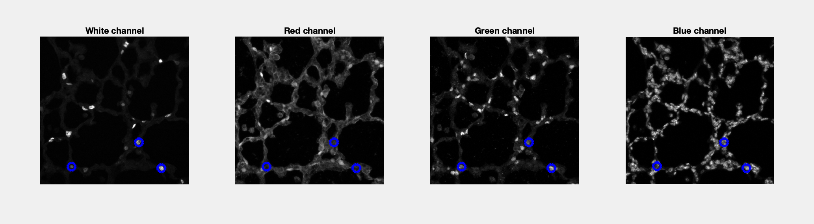

# HistologySegmentation3D
Segment 3D histology to identify cells that co-express multiple markers


Additional sample data can be found [here.] https://www.dropbox.com/t/PHR0ZghFKzXpgFk6


Run in a directory with histology images:
```
>> DL_ImSeg_test
```

This function will identify regions of interest in each panel:



... and then identify those that overlap for all markers.


